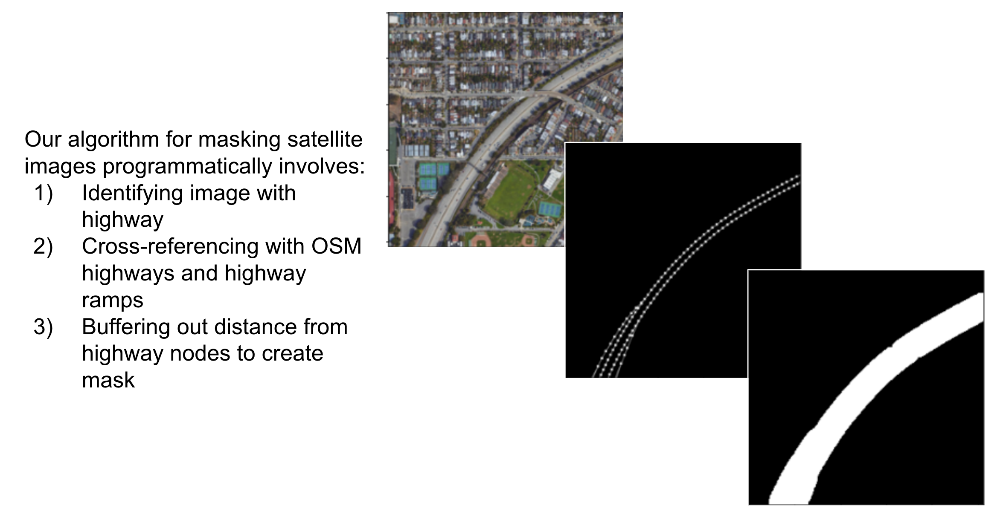
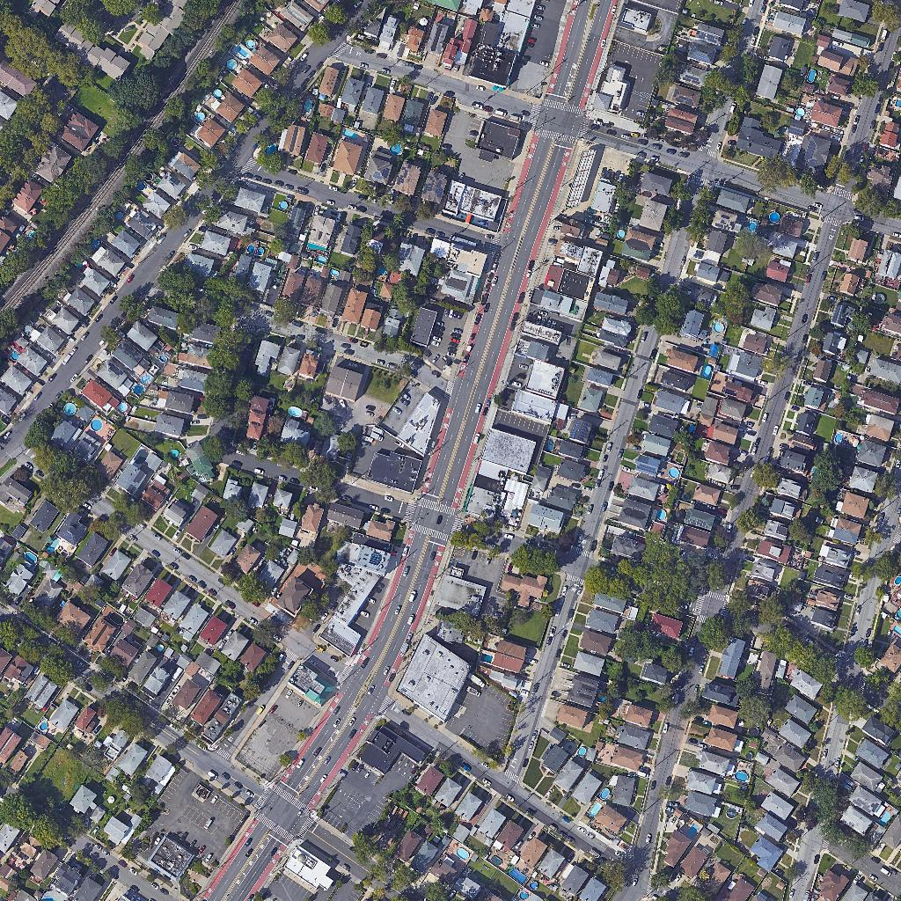
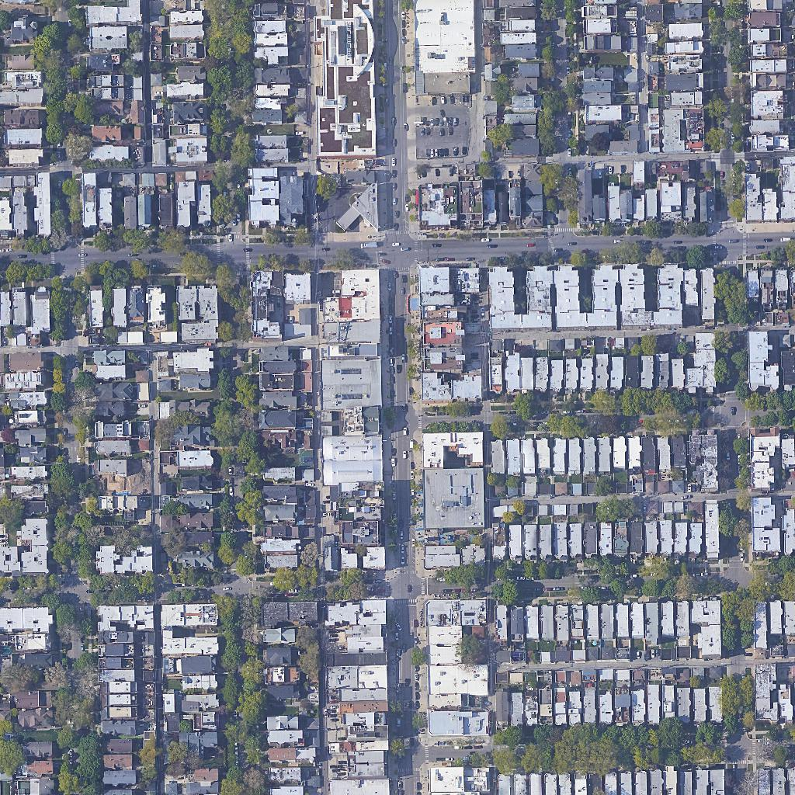
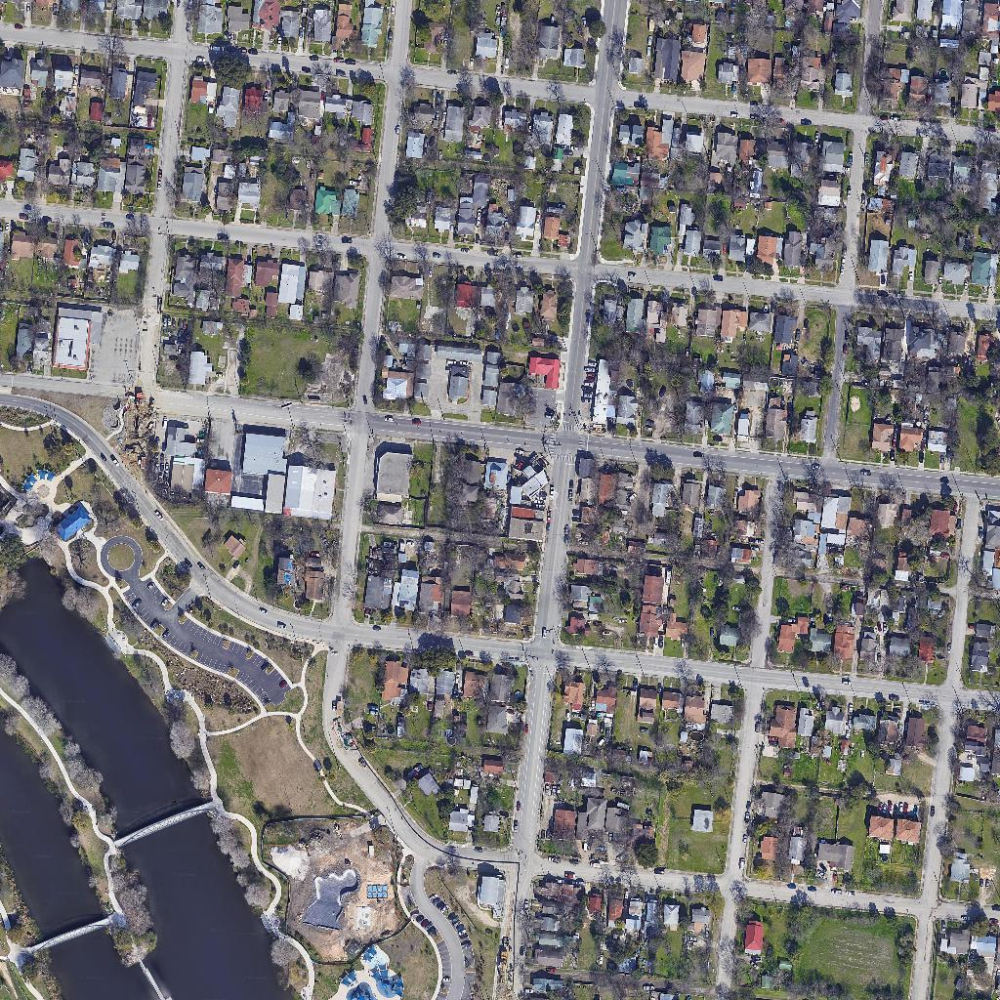
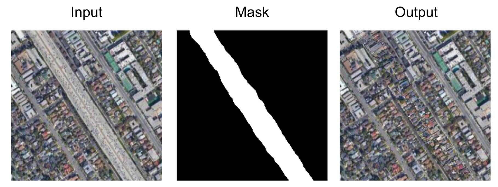
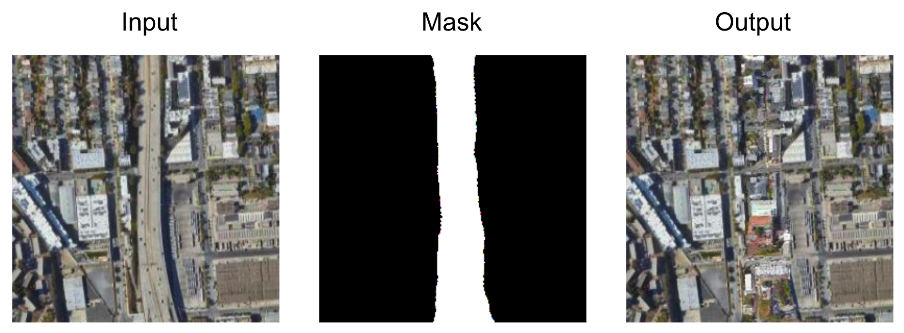

## Modeling Highway Removal

### "Segregation by design" in America's highways ###

#### "There is racism physically built into some of our highways, and that’s why the jobs plan has specifically committed to reconnect some of the communities that were divided by these dollars" - US Secretary of Transportation Pete Buttigieg 

In 2021, Congress passed a bipartisan bill with over $1 trillion in new infrastructure spending, to modernize America's highways, railroads, and airports. But over one billion dollars in the bill was marked for a cause that may surprise you: not building new infrastructure, but tearing down old highways. The New York Times has documented the history of some of these highways, "While Interstates were regularly used to destroy black neighborhoods, they were also used to keep black and white neighborhoods apart. Today, major roads and highways serve as stark dividing lines between black and white sections in cities like Buffalo, Hartford, Kansas City, Milwaukee, Pittsburgh and St. Louis. In Atlanta, the intent to segregate was crystal clear. Interstate 20, the east-west corridor that connects with I-75 and I-85 in Atlanta’s center, was deliberately plotted along a winding route in the late 1950s to serve, in the words of Mayor Bill Hartsfield, as “the boundary between the white and Negro communities” on the west side of town."

More recently, local activists have led a movement to bring down some of the most famous of these highways, and reconnect and restore the communities impacted by them. For example, in New Orleans, community leader Amy Stelly told the Times, "We have been talking about what to do with the highway for as long as I can remember," referring to the Claiborne Expressway.

  

Highways often form the dividing lines between neighborhoods with different racial makeup. Sometimes, creating that divide was intentional. Image source: New York Times

There has been significant additional journalism on the importance of removing these highways, including this article about Los Angeles, this op-ed calling for more beyond the $1 billion initial investment, this overview of the cities proposing to remove highways and the status of current projects, and this visualization of the Rondo neighborhood in St. Paul and the Treme neighborhood in New Orleans (bisected by the Claiborne Expressway). 

### Using generative modeling to reimagine these neighborhoods without highways ###

Readers will probably be familiar with the impressive advances enabled by diffusion and transformer models, from generating images based on text, to inpainting images based on sketches. One twitter account even chronicles how to use DALL-E to improve urban spaces. 

We wanted to use these models to support activists and urban planners imagining what to do with the space freed up by removing some of the highways that divided residents. Our workflow runs like this:

1: Identify a highway to inpaint using Google Maps

2: We use OpenStreetMaps data to identify and mask the highway in the image (generating a mask that covers all pixels within a certain distance of a highway node from OSM)

  

3: We trained a diffusion model on images without highways. As a result, the diffusion model attempts to paint in the mask based on the surrounding neighborhood. Because it has never seen a highway in training, it will inpaint with housing, new businesses, and new parks where the highway "used to be" in the image. 

  
  
  

Example images of residential neighborhoods and surface-roads from our training data. Source: Google Maps / Maxar

### Sample initial results: 

  
  

### Demo:

Want to use the web app yourself? Contact Jake Silberg (jsilberg at stanford.edu) for access.

### Next steps: 

We are working to add new ways for users to interact with our web app, including through sketches or through identifying a set of metrics they want to optimize for.

### Citations:

Meng, Chenlin, et al. "Sdedit: Image synthesis and editing with stochastic differential equations." arXiv preprint arXiv:2108.01073 (2021).

Schmidt, Victor, et al. "ClimateGAN: Raising Climate Change Awareness by Generating Images of Floods." arXiv preprint arXiv:2110.02871 (2021).

Yu, Jiahui, et al. "Free-form image inpainting with gated convolution." Proceedings of the IEEE/CVF international conference on computer vision. 2019.

Stanford ML Group: AI for Climate Change data processing. https://stanfordmlgroup.github.io/
